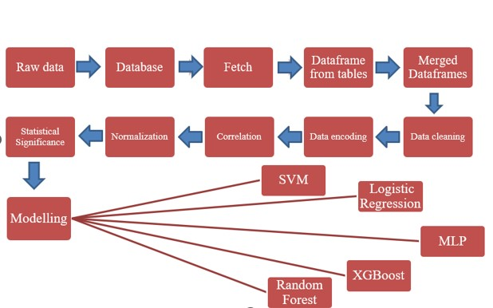

# Malware Classification

## Problem Statement

Malware on Android has increasingly been popular in recent years. This has evolved into an unparalleled menace, causing most internet security issues. The Android malware market is growing at a rapid pace, with thousands of new malware instances being discovered every day. With its increasing prevalence, it's become critical to identify Android malware on devices, lest it take over the world and become an unavoidable internet danger. It has become an open problem for cybersecurity specialists as a result of its unparalleled growth in recent years.

## Aim

This project aims to classify android malware samples taken from a huge malware dataset with 14 prominent malware categories and 385 eminent malware families based on the similarity of their attributes such as memory, API, network, battery, logcat, process using machine learning models.

## After and Before reboot states

"After reboot" and "before reboot" refer to two different states of a system or device. When a system is restarted or rebooted, it undergoes a fresh start, and all its components are reset. Thus, any issues or errors that were present before the reboot may be resolved, but new issues may also arise. Therefore, in the context of the given dataset, the 14 files labeled "before reboot" likely contain data collected before the system was rebooted, while the 14 files labeled "after reboot" likely contain data collected after the system was rebooted. The purpose of collecting data before and after the reboot is to compare the performance or behavior of the system in both states.

## Null Hypothesis

The classification of the various android malwares cannot be done using the machine learning models.

## Alternate Hypothesis

The classification of the various android malwares can be done using the machine learning models.

## Dataset details

I have used CCCS-CIC-AndMal-2020 Android malware dataset comprising of 200K benign and 200K malicious samples totaling 400K android apps, 14 significant malware categories, and 385 prominent malware families. Adware, backdoor, file infector, no category, potentially Unwanted Apps (PUA), ransomware, riskware, scareware, trojan, trojan-banker, trojan-dropper, trojan-sms, trojan-spy, and zero-day malware are among the 14 malware types collected for the dataset. To categorize Android malware, I used six types of dynamic parameters, including memory, API, network, logcat, battery, and process. The dataset contains a total of 28 csv files, among which 14 are for after reboot and 14 are for before reboot.

## Project Workflow

First the data was uploaded to the shared database in MySQL. To use MySQL in the project, a connection to the MySQL database can be established using Python libraries like mysql-connector-python which is demonstrated in **"SQL_DATABASE_CONNECTION.ipynb"**.

Next, I merged all after reboot files and all before reboot files into one file. This was done through **"Merging_files_before_after.ipynb"**.

Next, visualizations were done before cleaning and encoding which was done through **"Raw_Data_Visualization.ipynb"** for comparison purposes.

After that cleaning and preprocessing of data was performed. Initially upon merging we had 25059 rows and 144 columns and after cleaning we had 24183 rows and 29 columns for after reboot. For before reboot we had 28380 rows and 144 columns and were left with 22124 rows and 29 columns. After all the cleaning we saw that coincidently all the rows for the category ‘Zero_Day’ had either ‘unknown’ or ‘singleton’ as value in their ‘Family’ column so they all were dropped and hence now we only have 13 categories of malware to classify and not 14. As the machine learning models do not support strings, and they require input and output to be a numerical value, I encoded the ‘Category’ and ‘Family’ columns into numerical data; the encoded columns were named as ‘Category_en’ and ‘Family_en’. All this is demonstrated in **"CleaningData_noHash_LessRows.ipynb"** and **"Encoding_and_corelation.ipynb"**.

Next, I calculated the statistical significance of data using mutual information. Mutual information tells us how much information on average was communicated in one random variable about the other. In this case memory heap size can explain the label (i.e., Category variable) better because they share more mutual information. This was done through **"Corelation_heatmap.ipynb"**.

Once encoding and cleaning was done, I created visualizations on the cleaned data for comparison purposes through **"Cleaned_Data_Visualization.ipynb"**.

Finally the for the modeling part, I applied 5 machine learning models on the dataset for classification: Support Vector Machine (SVM), Logistic Regression, Multi-Layer Perceptron (MLP), XGBoost, and Random Forest. The results of the predictions made by the models indicated that the MLP and XgBoost models have performed the best with respect to the F1 score metric. This is done through **"Modelling_final.ipynb"**.

## Repository Structure

- `notebooks`: Contains all code files.
- `data`: Contains all raw and processed csv files for both after and before reboot states.
- `images`: Contains project workflow
- `README.md`: Contains project description and running intsructions.

